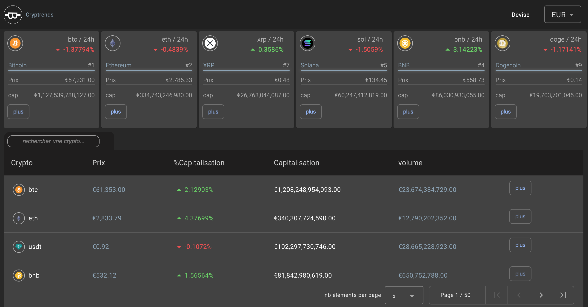
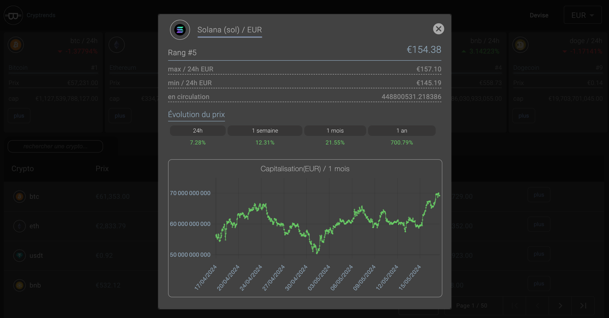

# Cryptrends

This project was generated with [Angular CLI](https://github.com/angular/angular-cli) version 17.3.7.

## Development server

Run `ng serve` for a dev server. Navigate to `http://localhost:4200/`. The application will automatically reload if you change any of the source files.

## Code scaffolding

Cryptrends is about tracking trends in crypto world, i made this app to have a better understanding of cryptos. This apps posts first the cryptos trending and a list of +200 depending of the chosen currency, each crypto details can also be posted with a detailed graph. This app's main purpose is to have a better understanding of cryptos.

## Home

Displaying trending cryptos in selected currency and a more over 200 crypto that can be filtered by name.

## Details

The selected crypto details show off the trends on the market for the last hour, day, week, month and year.

You can see on a detailed graph the trend on the selected crypto depending on the currency for the last month.

